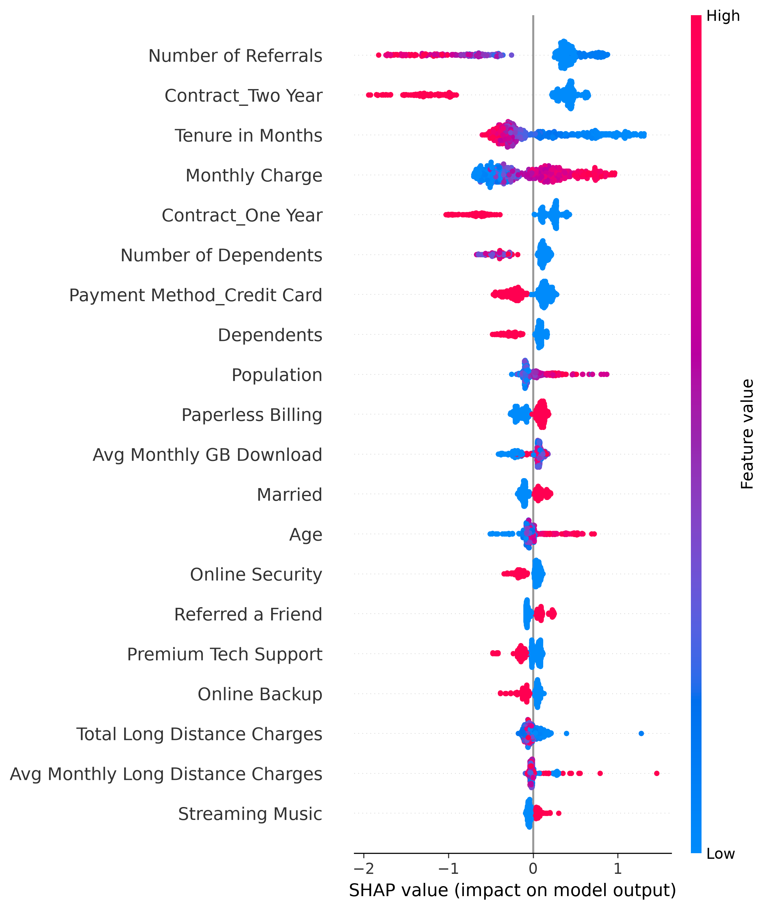

# 🤖 Customer Churn Prediction & Retention Analytics Platform

[](https://customer-churn-prediction-retention-analytics-hd5cea3mxqbnp7sh.streamlit.app)
[](#)
[](#)
[](#)

**An end-to-end ML system that predicts which customers will leave, explains *why*, and tells the business what to do about it — deployed as a live, interactive product, not a notebook.**

🌐 **[Try the live app →](https://customer-churn-prediction-retention-analytics-hd5cea3mxqbnp7sh.streamlit.app)**  |  📂 **[Jump to code](#-project-structure)**  |  📸 **[See screenshots](#-dashboard-screenshots)**

---

## ⚡ At a Glance

| | |
|---|---|
| **What it is** | A production-deployed churn prediction platform: data pipeline → ML models → explainability → business dashboard |
| **What it proves I can do** | Take a raw dataset all the way to a live product a non-technical stakeholder can use, with no hand-holding |
| **Headline result** | **84.46% accuracy / 0.84 ROC-AUC** on 7,043 real telecom customers, benchmarked across 5 algorithms |
| **What makes it different from a typical portfolio project** | It doesn't just predict — it **explains** every prediction with SHAP, segments customers into actionable risk tiers, and turns those tiers into specific retention recommendations a business team could act on today |
| **Stack** | Python, Pandas, Scikit-Learn, XGBoost, SHAP, Streamlit |
| **Try it live** | No install needed — [open the dashboard](https://customer-churn-prediction-retention-analytics-hd5cea3mxqbnp7sh.streamlit.app), upload a CSV or enter a customer manually, get a real prediction in seconds |

**Why this matters for a hiring decision:** most churn-prediction projects stop at a Jupyter notebook with an accuracy score. This one ships. It handles bad user input, validates uploaded data, explains its own decisions, and hands the business a downloadable action plan — the same lifecycle a real ML product needs in production.

📬 **Contact:** see [Author](#-author) below to connect.

---

## 📑 Table of Contents

- [Project Overview](#-project-overview)
- [Business Problem](#-business-problem)
- [Dataset](#-dataset)
- [Technology Stack](#-technology-stack)
- [Project Structure](#-project-structure)
- [ML Workflow](#-machine-learning-workflow)
- [Data Cleaning & Feature Engineering](#-data-cleaning--feature-engineering)
- [Model Development & Results](#-machine-learning-model-development)
- [Dashboard Features](#-interactive-streamlit-dashboard)
- [Explainable AI](#-explainable-ai)
- [Business Impact](#-business-impact)
- [Installation & Usage](#️-installation-guide)
- [Screenshots](#-dashboard-screenshots)
- [Future Improvements](#-future-improvements)
- [Skills Demonstrated](#-skills-demonstrated)
- [Author](#-author)

---

## 📌 Project Overview

Customer retention is one of the most important challenges for subscription-based businesses — acquiring a new customer is almost always more expensive than keeping an existing one. This project builds an AI-powered platform that helps organizations:

- Predict which customers are likely to churn
- Calculate churn probability per customer
- Classify customers into risk tiers
- Understand *why* each customer is at risk (not just that they are)
- Turn that understanding into concrete retention actions

**Combines:** ML classification · Explainable AI (SHAP) · interactive Streamlit dashboard · risk segmentation · KPI monitoring · batch prediction · data validation · downloadable reports.

---

## 🎯 Business Problem

Companies sit on large amounts of customer data but struggle to answer three questions:

1. **Which customers are likely to leave?** → ML finds hidden behavioral patterns
2. **Why are they leaving?** → Explainable AI reveals the drivers behind each prediction
3. **What should the business do about it?** → Analytics converts predictions into retention strategy

---

## 🏆 Project Objective

Build an end-to-end system that:

1. Cleans and prepares raw customer data
2. Engineers meaningful features
3. Trains and benchmarks multiple ML models
4. Selects the best-performing model objectively
5. Deploys it as a usable web app
6. Explains every prediction with SHAP
7. Converts predictions into retention recommendations

---

## 📊 Dataset

**Telco Customer Churn Dataset** — real telecommunications customer data covering demographics, account details, service subscriptions, billing, contracts, and churn status.

```
Customers:        7,043
Target Variable:  Churn Label
Problem Type:     Binary Classification
```

---

## 🛠 Technology Stack

| Layer | Tools |
|---|---|
| Language | Python |
| Data Processing | Pandas, NumPy |
| Machine Learning | Scikit-Learn (Logistic Regression, Decision Tree, Random Forest, Gradient Boosting), XGBoost |
| Explainable AI | SHAP |
| Visualization | Matplotlib, Streamlit |
| Model Serialization | Joblib |
| Deployment | Streamlit Community Cloud |
| Version Control | Git, GitHub |

---

## 🏗 Project Structure

```
Customer-Churn-Prediction/
│
├── app.py
├── README.md
├── requirements.txt
├── LICENSE
├── runtime.txt
│
├── data/
│   ├── raw/
│   └── processed/
│
├── models/
│   ├── best_model.pkl
│   ├── scaler.pkl
│   ├── feature_names.pkl
│   ├── label_encoders.pkl
│   ├── categorical_columns.pkl
│   └── numeric_columns.pkl
│
├── reports/
│   ├── figures/
│   └── model_results/
│       ├── feature_importance.csv
│       └── model_comparison.csv
│
└── src/
    ├── data_cleaning.py
    ├── feature_engineering.py
    ├── train.py
    └── evaluate.py
```

---

## 🔄 Machine Learning Workflow

```
Raw Dataset → Data Cleaning → EDA → Feature Engineering → Encoding & Scaling
    → Train-Test Split → Model Training → Model Evaluation → Best Model Selection
    → Streamlit Deployment → SHAP Explainability → Retention Recommendations
```

---

## 🧹 Data Cleaning & Feature Engineering

**Removed identifier columns** (Customer ID, City, Zip Code, Latitude, Longitude, Country) — no predictive value.

**Removed data-leakage columns** (Customer Status, Churn Score, Churn Category, Churn Reason, Satisfaction Score) — these directly reveal the outcome and would inflate performance unrealistically. *(Catching leakage like this before it silently wrecks your metrics is a habit, not a one-off.)*

**Feature engineering performed:** binary encoding, one-hot encoding, numerical scaling, feature selection, train/test splitting.

---

## 🤖 Machine Learning Model Development

Five classification algorithms were trained and benchmarked head-to-head:

| Model | Description |
|---|---|
| Logistic Regression | Baseline classification model |
| Decision Tree | Rule-based model |
| Random Forest | Ensemble learning |
| Gradient Boosting | Advanced boosting algorithm |
| XGBoost | Gradient boosting framework |

### 🏆 Final Model: Gradient Boosting Classifier

Selected on ROC-AUC score, cross-validation performance, and full classification metrics — not accuracy alone.

| Metric | Result |
|---|---|
| **Accuracy** | **84.46%** |
| **ROC-AUC** | **0.84** |

---

## 🚀 Interactive Streamlit Dashboard

The trained model isn't locked in a notebook — it's deployed as a live dashboard a business user can actually operate.

- **📊 Executive Overview** — total customers, churned, retained, churn rate at a glance
- **🔮 Prediction Engine** — manual single-customer prediction *or* batch prediction via CSV upload
- **📂 Smart Dataset Validation** — detects unsupported files, validates structure, handles missing columns, blocks bad predictions with clear error messages
- **⚠ Risk Segmentation** — Low (0–30%), Medium (30–70%), High (70–100%) risk tiers
- **📈 Prediction Distribution** — churn vs. retained visualizations, risk distribution charts
- **🧠 Model Insights** — feature importance, top churn drivers, performance metrics
- **🔍 Explainable AI (SHAP)** — every single prediction shows which features pushed it up or down, plus global model explanations
- **📥 Export** — download full results as `customer_churn_predictions.csv` with prediction, probability, and risk level
- **💡 Business Recommendations** — risk-tier-specific retention actions (e.g. High Risk → loyalty discounts, annual contract incentives, proactive support outreach)

---

## 🧠 Explainable AI

A prediction without a reason isn't useful to a business. This project integrates **SHAP (SHapley Additive Explanations)** so every churn score comes with an answer to "why":

- Individual customer-level explanations
- Global model-level explanations
- Clear breakdown of features increasing vs. decreasing churn risk
- Builds trust in the model instead of asking stakeholders to take it on faith

---

## 📈 Business Impact

This solution lets an organization:

- Catch churn before it happens, not after
- Identify high-value customers at risk early
- Prioritize retention spend using risk scores instead of guesswork
- Reduce preventable revenue loss
- Make retention a data-driven function instead of a reactive one

---

## ⭐ Key Features

End-to-end pipeline · churn prediction · SHAP explainability · interactive dashboard · manual + batch prediction · smart validation · KPI dashboard · risk segmentation · feature importance visualization · downloadable reports · business recommendations · production deployment.

---

## ⚙️ Installation Guide

```bash
# Clone the repo
git clone https://github.com/YashPrajapati989/customer-churn-prediction-retention-analytics.git
cd customer-churn-prediction-retention-analytics

# Install dependencies
pip install -r requirements.txt
```

### Train the model
```bash
python src/train.py
```
Generates `best_model.pkl`, `feature_names.pkl`, `scaler.pkl`, and encoders.

### Launch the dashboard
```bash
streamlit run app.py
```

### Requirements
```
pandas, numpy, scikit-learn, streamlit, shap, matplotlib, joblib, xgboost
```

---

## 📸 Dashboard Screenshots

Screenshots live in [`reports/figures/`](reports/figures) — this section is prime real estate for recruiters who won't click through to the live demo, so it's worth embedding a few directly here.




---

## 🔮 Future Improvements

- REST API via FastAPI
- Automated model retraining pipeline
- Database integration for live customer feeds
- Real-time prediction streaming
- MLOps monitoring (drift detection, model versioning)
- AI-generated retention copy per customer

---

## 🎓 Skills Demonstrated

Python · Data Cleaning · EDA · Feature Engineering · ML Classification · Hyperparameter Tuning · Model Evaluation · Explainable AI (SHAP) · Business Intelligence · Dashboard Development · Streamlit Deployment · Data Validation · Batch Prediction Systems · Business KPI Reporting · Git & GitHub

---

## 👨‍💻 Author

**Yash Prajapati**
Data Science | Machine Learning | Analytics

<!-- 🔗 Add your links so recruiters don't have to hunt for them:
[](YOUR_LINKEDIN_URL)
[](mailto:YOUR_EMAIL)
[](YOUR_PORTFOLIO_URL)
-->

---

## ⭐ Project Summary

This project turns raw customer data into a live decision-support tool: it predicts churn, explains why, and tells the business what to do next — end to end, deployed, and usable by someone who has never opened a Jupyter notebook.

**[⭐ Star this repo](https://github.com/YashPrajapati989/customer-churn-prediction-retention-analytics)** if you found it useful — and if you're hiring for a data science / ML role, [try the live app](https://customer-churn-prediction-retention-analytics-hd5cea3mxqbnp7sh.streamlit.app) before you scroll past.
